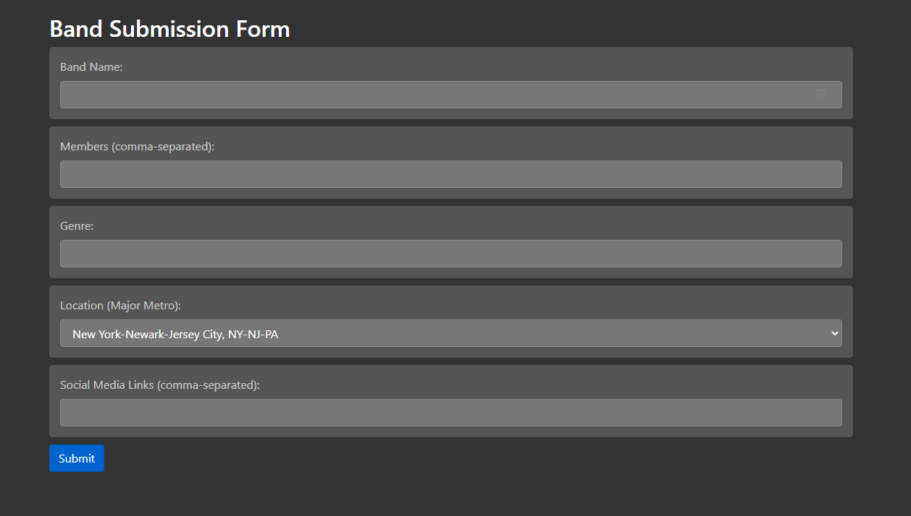

# Band Submission Flask App
## Overview
This Flask application provides a simple web form for submitting band information, including details like band name, members, genre, and social media links. The application stores submissions in a CSV file and allows selection of metropolitan areas from a dropdown, powered by data from another CSV.



## Features
- Submit band information via a web form.
- Auto-generate UUID for each submission.
- Store submissions in a bands.csv file.
- Dynamically populated metro area dropdown based on metros.csv.

## Installation
To set up this project locally, follow these steps:

### Prerequisites
* Python 3.7 or higher
* Flask
* Docker (optional, for containerization)

### Clone the Repository
```bash
git clone https://github.com/reidwil/tour-manager.git
cd tour-manager
```

### Install Dependencies
```bash
pip install -r requirements.txt
```

## Usage
### Running the Application Locally
```bash
flask run
```

Access the application at http://localhost:5000.


### Running with Docker
Build the Docker image:
```bash
docker build -t flask-app .
```
Run the Docker container:

```bash
docker run -p 5000:5000 flask-app
```
Access the application at http://localhost:5000.

## Configuration
- bands.csv: Stores band data.
- metros.csv: Contains IDs and names of US metro areas.
Ensure these CSV files are properly formatted and located in the project root.

## Contributing
Contributions are welcome! For major changes, please open an issue first to discuss what you would like to change.
